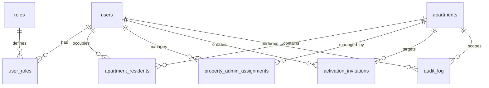

# AnfieldVoice — Product Requirements Document

> **Product**: AnfieldVoice — Property Administrator Role Management for Residential Estates
> **Company**: Red Cape Technologies (Pty) Ltd
> **Version**: 1.0.0-draft
> **Status**: Backend complete, mobile app in build-out

---

## 1. Product Overview

AnfieldVoice is a role-based resident & visitor management platform for gated residential estates. It replaces paper registers and ad-hoc WhatsApp groups with a structured system of **additive roles**, **granular permissions**, and a **full audit trail**.

### Core Problem
Estate management today relies on spreadsheets and phone trees. When a non-resident property manager needs to add a tenant, or security needs to verify a visitor, there's no unified system with role-appropriate views. Security calls a resident who may not answer; the property manager can't independently manage their units; and there's no audit trail of who was added, by whom, and when.

### Solution
A mobile-first platform where:
- **Residents** receive gate calls, generate visitor PINs, and manage their apartment
- **Property Administrators** (resident or non-resident) manage tenants for assigned apartments
- **Security** processes visitors at the gate
- **Body Corporate** has estate-wide oversight and admin assignment

---

## 2. User Roles & Permissions Matrix (Authoritative Spec)

### 2.1 Additive Role System

Roles are **string-based enums**. A user may have multiple roles simultaneously. The `property_admin` role is further qualified by an `is_resident` flag on the apartment assignment.

| Role ID | Role Name | Description |
|---------|-----------|-------------|
| 1 | `resident` | Apartment occupant. Receives gate calls, generates PINs, manages recurring visitors. |
| 2 | `property_admin` | Manages tenancy and user access for assigned apartments. May be resident or non-resident. |
| 3 | `security` | Gate security officer. Processes visitors, admits/denies access, calls residents. |
| 4 | `maintenance` | Estate maintenance staff. Manages work orders and facility access. |
| 5 | `body_corp_admin` | Body corporate administrator. Estate-wide config, analytics, resident management. |
| 6 | `super_admin` | Platform super admin. Full system access. |

### 2.2 Permissions Matrix

| Function | Resident | Property Admin (Resident) | Property Admin (Non-Resident) | Body Corp / Super Admin |
|---|---|---|---|---|
| Receive gate calls | ✓ | ✓ | ✗ | ✓ |
| Generate visitor PIN | ✓ | ✓ | ✗ | ✓ |
| Create expected arrival | ✓ | ✓ | ✗ | ✓ |
| Add tenants | ✗ | ✓ | ✓ | ✓ |
| Remove tenants | ✗ | ✓ | ✓ | ✓ |
| Activate/deactivate residents | ✗ | ✓ | ✓ | ✓ |
| View apartment activity | Limited | ✓ | ✓ | ✓ |
| Estate administration | ✗ | ✗ | ✗ | ✓ |

### 2.3 Design Principles (Enforced by Tests)

1. **Roles are additive** — a user can be Resident + Property Admin simultaneously on the same apartment
2. **Non-resident PA never gets resident perks** — they manage remotely, never receive gate calls or generate PINs
3. **Non-resident PA never appears as occupant** — they are not listed in the apartment directory
4. **Soft-delete for residents** — `is_active = FALSE`, never hard-deletes occupant history
5. **Immutable audit trail** — every admin action recorded with before/after JSONB snapshots
6. **Configurable, not hard-coded** — `PermissionSet` is data-driven by boolean flags, not hard-coded user types

---

## 3. Current Backend Architecture (Complete)

### 3.1 Stack

| Layer | Technology |
|-------|-----------|
| Framework | FastAPI (Python 3.12) |
| Database | PostgreSQL via asyncpg |
| Auth | JWT (HS256) + bcrypt |
| Validation | Pydantic v2 |
| Host | Linux (env-configured) |

### 3.2 API Endpoints

All endpoints under `/api/v1`:

| Group | Method | Path | Auth Required | Permission Check |
|-------|--------|------|---------------|------------------|
| **Auth** | POST | `/auth/login` | No | — |
| **User** | GET | `/me` | JWT | — |
| **Permissions** | GET | `/permissions/{apartment_id}` | JWT | — |
| | GET | `/permissions/{apartment_id}/check/{action}` | JWT | — |
| **Apartments** | GET | `/my-apartments` | JWT | property_admin / body_corp |
| **Residents** | GET | `/apartments/{id}/residents` | JWT | any role for apt |
| | POST | `/apartments/{id}/residents` | JWT | ADD_TENANTS |
| | DELETE | `/apartments/{id}/residents/{uid}` | JWT | REMOVE_TENANTS |
| | POST | `/apartments/{id}/residents/{uid}/activate` | JWT | ACTIVATE_RESIDENTS |
| | POST | `/apartments/{id}/residents/{uid}/deactivate` | JWT | REMOVE_TENANTS |
| **Property Admins** | POST | `/property-admins` | JWT | body_corp / super_admin |
| | DELETE | `/property-admins/{apt}/{uid}` | JWT | body_corp / super_admin |
| **Invitations** | POST | `/invitations` | JWT | ADD_TENANTS |
| | GET | `/invitations/{apartment_id}` | JWT | property_admin for apt |
| **Audit** | GET | `/audit/{apartment_id}` | JWT | VIEW_APARTMENT_ACTIVITY |
| **Health** | GET | `/health` | No | — |

### 3.3 Data Model



### 3.4 Key Tables

| Table | Purpose | Key Columns |
|-------|---------|-------------|
| `users` | All system users | email, phone, full_name, password_hash, is_active |
| `roles` | 6 system roles | role_name, description |
| `user_roles` | Many-to-many user↔role | user_id, role_id, granted_by |
| `apartments` | Residential units | building, unit_number, max_residents |
| `apartment_residents` | User↔apartment occupancy | user_id, apartment_id, is_primary, is_active, move_in/out_date |
| `property_admin_assignments` | PA↔apartment management | user_id, apartment_id, is_resident, revoked_at |
| `activation_invitations` | Onboarding invitations | email, token, expires_at, status |
| `audit_log` | Immutable admin trail | admin_user_id, action, previous_value(JSONB), new_value(JSONB) |

---

## 4. Current Mobile App State

### 4.1 What Exists (Scaffolded)

| Feature | Status | Details |
|---------|--------|---------|
| Expo project setup | ✓ Done | Expo SDK 52, Expo Router v4, TypeScript |
| Theme / design tokens | ✓ Done | Dark navy theme (`#0F172A`), role-specific accent colours |
| API client | ✓ Done | Token storage via SecureStore, all endpoints mapped |
| Auth context | ✓ Done | Login/logout, token persistence on app restart |
| Login screen | ✓ Done | Email + password form |
| Home dashboard | ✓ Done (partial) | Welcome greeting, role badges, quick action grid, apartment list |
| Apartment detail | ✓ Done (partial) | Resident list, permissions snapshot, audit log, tab navigation |
| Estate tab | □ Stub | Empty screen scaffold |
| Profile tab | ✓ Done | User info, roles, sign out, account deletion with confirmation modal |
| Residents tab | □ Stub | Empty screen scaffold |
| Gate call screen | ✗ Not started | |
| Visitor PIN generator | ✗ Not started | |
| Expected arrival | ✗ Not started | |
| Invitation creation | ✗ Not started | |
| Resident add/remove UI | ✗ Not started | (API client functions exist, no UI) |
| Property admin assignment | ✗ Not started | |
| Push notifications | ✗ Not started | |
| Offline support | ✗ Not started | |

### 4.2 What's Partially Working

- **Home screen** correctly conditionally renders role-based views and quick actions, but cards are stubs (`onPress={() => {}}`). The apartment list loads for property admins/body corp.
- **Apartment detail** loads residents, permissions, and audit log from the API. Resident cards have active/suspended toggle. Missing: add resident modal, remove resident confirmation, invitation dialog.
- **Auth flow** works end-to-end — login stores JWT, app restores session on cold start.

---

## 5. Mobile App Build Plan

### Phase 1: Core Functionality (Next Sprint)

| # | Feature | Screen(s) | Priority | Effort |
|---|---------|-----------|----------|--------|
| 1.1 | **Gate Call screen** | New: `(tabs)/gate.tsx` | P0 | 1d |
| 1.2 | **Visitor PIN generation** | New: modal or bottom sheet | P0 | 0.5d |
| 1.3 | **Expected arrival** | New: `(tabs)/arrivals.tsx` or modal | P0 | 1d |
| 1.4 | **Add / remove resident UI** | `apartment/[id].tsx` — modal | P0 | 1d |
| 1.5 | **Invitation flow** | `apartment/[id].tsx` — modal + accept screen | P0 | 1d |
| 1.6 | **Wire up quick action cards** | `home.tsx` — replace stubs | P0 | 0.5d |

**Total Phase 1: ~5 days**

### Phase 2: Admin Features

| # | Feature | Screen(s) | Priority | Effort |
|---|---------|-----------|----------|--------|
| 2.1 | **Estate tab (body corp)** | `(tabs)/estate.tsx` — full implementation | P1 | 2d |
| 2.2 | **Property admin assignment UI** | `estate.tsx` — assign/revoke PAs | P1 | 1d |
| 2.3 | **Apartment creation (body corp)** | `estate.tsx` — admin panel | P1 | 1d |
| 2.4 | **Audit log filtering + search** | `apartment/[id].tsx` — audit tab | P1 | 0.5d |

**Total Phase 2: ~4.5 days**

### Phase 3: Resident Experience

| # | Feature | Screen(s) | Priority | Effort |
|---|---------|-----------|----------|--------|
| 3.1 | **Apartment directory (neighbours)** | New: `(tabs)/directory.tsx` | P1 | 1d |
| 3.2 | **Recurring visitors** | New: `(tabs)/visitors.tsx` | P1 | 1.5d |
| 3.3 | **Notifications / activity feed** | Home dashboard — recent activity | P1 | 1d |

**Total Phase 3: ~3.5 days**

### Phase 4: Infrastructure & Polish

| # | Feature | Notes | Priority | Effort |
|---|---------|-------|----------|--------|
| 4.1 | **Push notifications** | FCM / Expo push for gate calls | P1 | 2d |
| 4.2 | **Error boundaries + loading states** | UX polish | P1 | 1d |
| 4.3 | **CI/CD setup** | EAS Build + auto-deploy | P2 | 1d |
| 4.4 | **Offline cache** | React Query or local-first (WatermelonDB) | P2 | 3d |
| 4.5 | **Role-conditional navigation** | Hide tabs user can't access | P1 | 0.5d |

**Total Phase 4: ~7.5 days**

---

## 6. Screen Map & Navigation

```
App Root
├── Splash (check stored token)
├── Login (/login)
└── Main Tab Navigator (authenticated)
    ├── 🏠 Home (home.tsx) — Quick actions + apartment list
    ├── 🚪 Gate (gate.tsx) — Incoming calls, admit/deny
    │   └── [New] Gate Call card → accept/deny modal
    ├── 📋 Directory (directory.tsx) — Neighbours by apartment
    ├── ⚙️ Estate (estate.tsx) — Body corp: assignments, apartments
    |   └── [New] Assign PA modal
    |   └── [New] Create apartment modal
    └── 👤 Profile (profile.tsx) — Account, roles, logout
        └── Notifications settings
        └── Account details

Modal Stack:
├── Visitor PIN Generator (from Home → Quick Action)
├── Expected Arrival (from Home → Quick Action)
├── Apartment Detail (/apartment/[id])
│   ├── Residents tab → Add Resident modal
│   │                  → Remove Resident confirmation
│   ├── Audit tab → (search/filter)
│   └── Invite button → Create Invitation modal
└── Accept Invitation (deep link or post-login)
```

### Tab Visibility by Role

| Tab | Resident | Property Admin | Security | Body Corp | Super Admin |
|-----|----------|---------------|----------|-----------|-------------|
| Home | ✓ | ✓ | ✓ | ✓ | ✓ |
| Gate | ✓ (their calls) | ✓ (if resident) | ✓ (all calls) | ✓ (oversight) | ✓ |
| Directory | ✓ (their building) | ✓ (their apartments) | ✓ | ✓ | ✓ |
| Estate | ✗ | ✗ | ✗ | ✓ | ✓ |
| Profile | ✓ | ✓ | ✓ | ✓ | ✓ |

---

## 7. UI/UX Specifications

### 7.1 Design System (Existing)

| Token | Value | Usage |
|-------|-------|-------|
| Background | `#0F172A` (deep navy) | Main app bg |
| Card bg | `#1E293B` | Cards, inputs |
| Elevated bg | `#334155` | Modals, sheets |
| Primary text | `#F1F5F9` | Body copy |
| Secondary text | `#94A3B8` | Labels, metadata |
| Primary blue | `#2563EB` | Actions, active states |
| Success green | `#10B981` | Active, verified |
| Warning amber | `#F59E0B` | Pending, property admin role |
| Error red | `#EF4444` | Errors, removed, super admin role |

Role accent colours (for badges, indicators):
- Resident: `#10B981` (green)
- Property Admin: `#F59E0B` (amber)
- Security: `#3B82F6` (blue)
- Maintenance: `#8B5CF6` (purple)
- Body Corp: `#EC4899` (pink)
- Super Admin: `#EF4444` (red)

### 7.2 Component Library (Existing)

| Component | Status | File |
|-----------|--------|------|
| `Card` | ✓ Done | `src/components/Card.tsx` |
| `Button` | ✓ Done | `src/components/Button.tsx` |
| `RoleBadge` | ✓ Done | `src/components/RoleBadge.tsx` |
| `RoleBadgeList` | ✓ Done | Same file |
| Inputs / Form fields | ✗ Need | New component |
| Modal / Bottom sheet | ✗ Need | Use `react-native-reanimated` |
| Resident card | ✓ Done | Inline in `apartment/[id].tsx` — should extract |
| Quick action card | ✓ Done | Inline in `home.tsx` — should extract |

---

## 8. Key Technical Decisions

| Decision | Choice | Rationale |
|----------|--------|-----------|
| Framework | **Expo SDK 52** with Expo Router v4 (file-based) | Fast dev, OTA updates, push notifications out of the box |
| Navigation | **Expo Router** (file-based) | Convention over config, deep linking built-in |
| State management | **React Context** (auth) + component-local state | App is API-driven, no complex client state yet. Revisit for offline |
| API client | **fetch** wrapped in typed functions + SecureStore | Minimal deps, JWT stored securely on device |
| Styling | **StyleSheet** + design token constants | No runtime styling overhead, simple, predictable |
| Animations | **react-native-reanimated** (already a dep) | Needed for modal transitions, gate call UX |
| Push notifications | **Expo Notifications** (FCM/APNs) | Planned — gate call alerts are a critical UX path |
| Account deletion | **Anonymize PII, retain audit trail** | POPIA-compliant: PII is removed, but immutable audit entries preserve estate security records |

---

## 9. Account Deletion (Play Store Requirement)

Google Play requires all apps with account creation to provide an in-app account deletion mechanism.

### 9.1 Implementation

**Backend** — `POST /api/v1/me/delete-account`
- Accepts `{ confirm: true, reason?: string }`
- Anonymizes `email` → `deleted-{id}@deleted.anfieldvoice.local`
- Nullifies `phone`, sets `full_name` → `Deleted User`
- Clears `password_hash` (login impossible)
- Sets `is_active = FALSE`
- Soft-removes from all `apartment_residents`
- Revokes all `property_admin_assignments`
- Expires all pending `activation_invitations` created by the user
- Writes immutable audit entry with before/after state
- Preserves audit trail integrity — user_id remains valid in audit_log

**Mobile** — Profile screen
- "Delete Account" button below Sign Out
- Two-step confirmation: reason (optional) + type "DELETE" to confirm
- Loading state during API call
- On success: shows success message, clears stored token, navigates to login

### 9.2 What Gets Preserved

| Data type | Preserved? | Why |
|-----------|-----------|-----|
| Audit log entries | ✓ (anonymized) | Estate compliance & security records |
| Apartment history | ✓ (deactivated) | Resident roster history intact |
| Invitation records | ✓ (marked revoked) | Shows who was invited and when |
| PII (email, name, phone) | ✗ Anonymized | POPIA data subject right |
| Password | ✗ Cleared | Prevents re-login |

---

## 10. Play Store Readiness Checklist

| # | Requirement | Status | Notes |
|---|-------------|--------|-------|
| 1 | **Account deletion** | ✓ Done | `POST /api/v1/me/delete-account` + in-app UI |
| 2 | **Privacy Policy URL** | ✓ Done | `Privacy_Policy.html` committed to repo |
| 3 | **Open source notices** | ✓ Done | Included in Privacy Policy page |
| 4 | **Content rating** | □ Pending | "Everyone" — takes 10min in Play Console |
| 5 | **Screenshots** | □ Pending | Dark theme — take on real device or emulator |
| 6 | **App description** | □ Pending | B2B estate management, invite-only registration |
| 7 | **App signing** | □ Pending | EAS Build handles this |
| 8 | **Minimal permissions** | ✓ Auto | INTERNET only — no camera, location, SMS |
| 9 | **API level compliance** | ✓ Auto | Expo SDK 52 targets current Android API levels |
| 10 | **No restricted category** | ✓ Auto | B2B estate management — no gambling/health/finance |

### Category & Permissions
- **Category**: Tools or Productivity
- **Permissions**: `android.permission.INTERNET` only
- **Registration**: Invite-only (property admin adds users) — allowed, no public signup required
- **Data handling**: Admin-managed resident data, not public UGC — no content moderation requirement

---

## 11. Risks & Open Questions

| Risk | Impact | Mitigation |
|------|--------|------------|
| Gate calls are real-time — polling is not acceptable | High | Need WebSocket or SSE from backend for real-time gate call delivery. Alternatively: push notifications with "Accept" action button. |
| Non-resident PA separation is a hard requirement enforced in tests — UI must not accidentally show gate features | Medium | Permission-driven UI: every feature checks `can()` before rendering. Must test with non-resident PA seed data. |
| Invitation expiry (7 days) — user may try to accept expired token | Low | Backend validates. UI should show clear error and offer "Request new invitation" CTA. |
| Estate-wide features need a "select apartment" pattern | Medium | Reuse the apartment picker throughout estate screens. |
| Push notifications require Apple Developer Program + Google Play Console | Medium | Start with periodic polling / pull-to-refresh for MVP. Add push post-MVP. |
| GDPR / POPIA compliance for resident data | Low | Backend captures audit trail. Mobile must handle data deletion requests. |

---

## 12. Definition of Done

A feature is complete when:

- [ ] All permission checks enforced on the backend (✓ already done)
- [ ] Mobile screen renders with role-appropriate UI
- [ ] All user flows work end-to-end (login → action → verification)
- [ ] API client functions exist for each backend endpoint (✓ most done)
- [ ] Error states are handled (network failure, unauthorized, forbidden, not found)
- [ ] Loading states shown during API calls
- [ ] Pull-to-refresh refreshes data
- [ ] Permission matrix tests pass (if backend changes)
- [ ] Dark theme is consistent with design tokens
- [ ] Audit trail is written for all admin actions (✓ backend handles this)

---

## 13. Build Order Recommendation

```
Week 1  │ Phase 1: Gate calls + PINs + arrivals + tenant mgmt
Week 2  │ Phase 2: Estate admin + property admin assignment + audit
Week 3  │ Phase 3: Neighbour directory + recurring visitors + activity feed
Week 4  │ Phase 4: Push notifications + polish + CI/CD
```

Each week ends with a testable build on a physical device via Expo Go or EAS.

---

## Appendix A: Key Backend Files Reference

| File | Path | LOC | Purpose |
|------|------|-----|---------|
| API router | `src/api/__init__.py` | 693 | All REST endpoints |
| Permissions engine | `src/permissions.py` | 211 | PermissionSet & DB resolution |
| Auth middleware | `src/auth.py` | 227 | JWT + bcrypt + FastAPI deps |
| Pydantic models | `src/models.py` | 238 | Request/response schemas |
| Audit trail | `src/audit.py` | 171 | Write + query + decorator |
| DB connection | `src/database.py` | 36 | asyncpg pool + auto-migrate |
| Schema | `db/schema.sql` | 233 | DDL + views + role seeds |
| Seed data | `db/seed.sql` | 163 | 9 test users with all role combos |
| Permission tests | `tests/test_permissions.py` | 443 | Matrix validation |

## Appendix B: Key Mobile Files Reference

| File | Path | LOC | Purpose |
|------|------|-----|---------|
| API client | `anfieldvoice-mobile/src/api/client.ts` | 219 | All API calls + token mgmt |
| Auth context | `anfieldvoice-mobile/src/contexts/AuthContext.tsx` | 87 | Auth state provider |
| Theme tokens | `anfieldvoice-mobile/src/theme.ts` | 81 | Colors, spacing, fonts |
| Types | `anfieldvoice-mobile/src/types/index.ts` | 130 | TS interfaces |
| Home screen | `anfieldvoice-mobile/app/(tabs)/home.tsx` | 312 | Role-based dashboard |
| Apartment detail | `anfieldvoice-mobile/app/apartment/[id].tsx` | 250 | Resident + audit + perms |
| Package | `anfieldvoice-mobile/package.json` | 32 | Expo SDK 52 deps |
